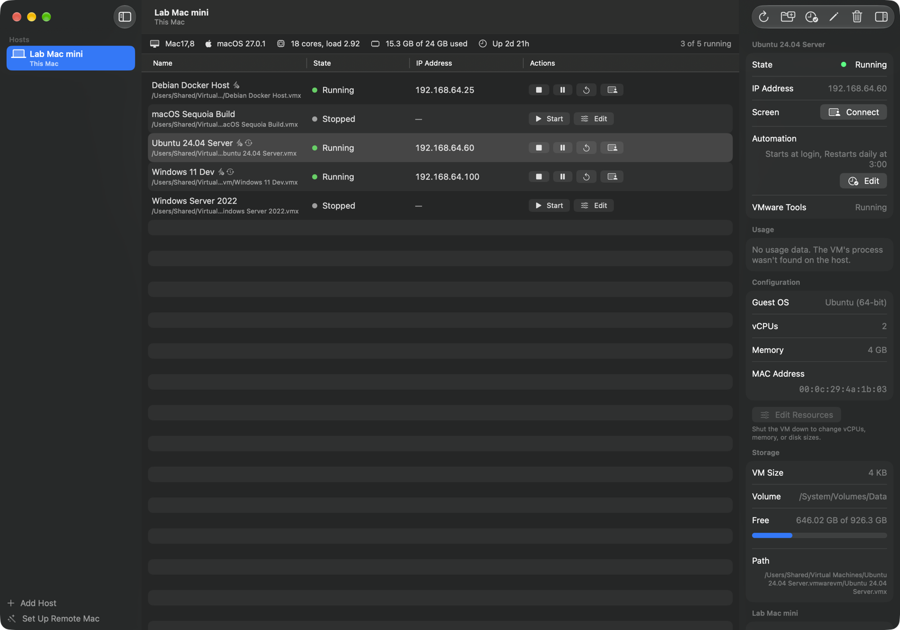
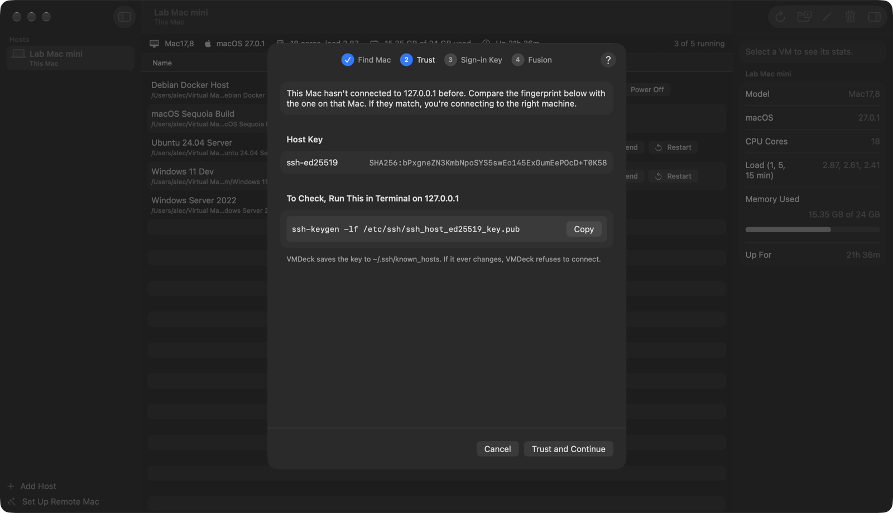
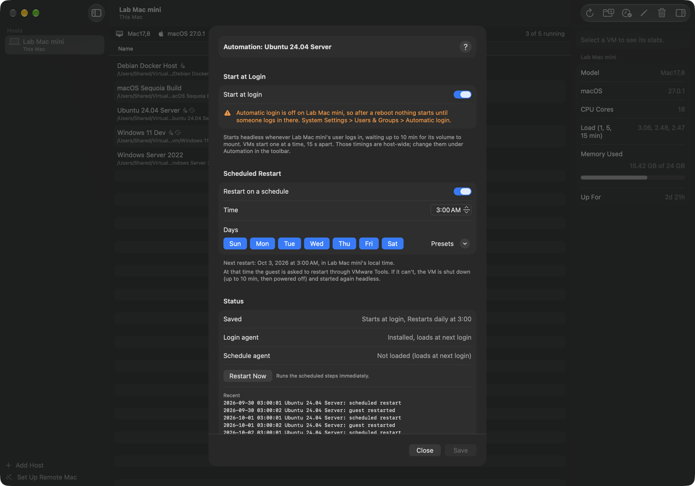
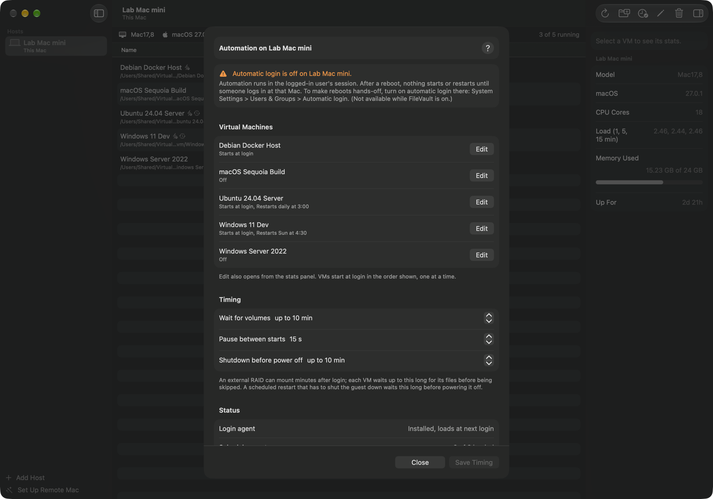
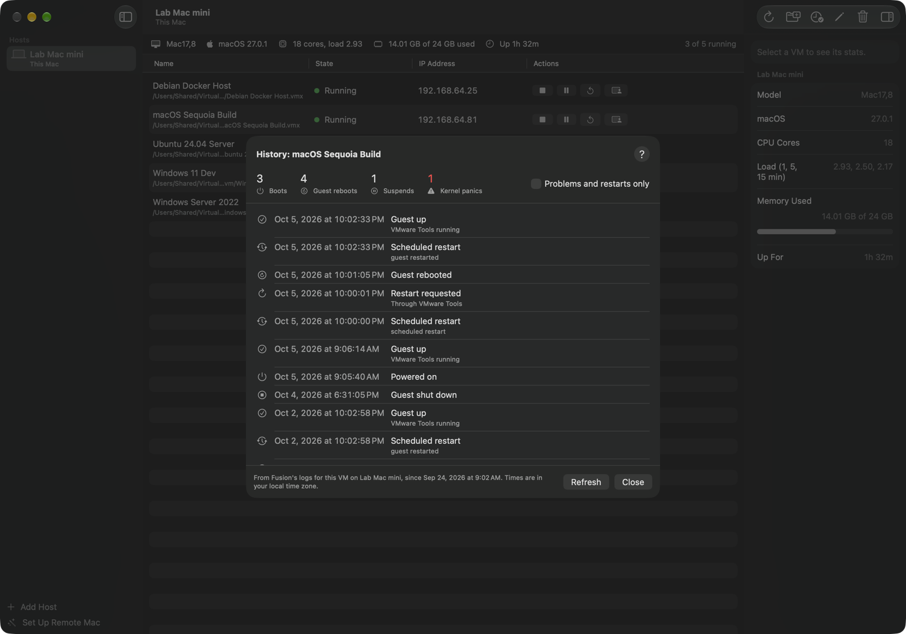
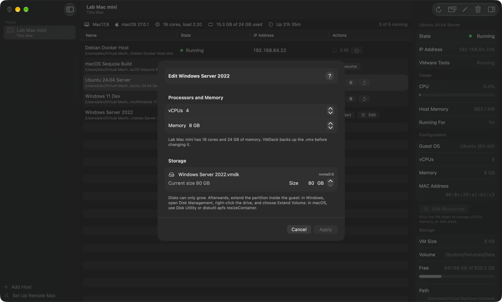

# VMDeck

A macOS app for running VMware Fusion virtual machines **headless**, with no
Fusion window, on this Mac or on other Macs over SSH.

VMDeck lists every VM on a host, whether running, suspended, or shut down. You
can start, shut down, suspend, and restart them. It shows live CPU, memory, and
network stats, and can change a VM's vCPUs, memory, and disk sizes. It drives
Fusion through `vmrun`, the command-line tool inside every Fusion install, so
there's nothing to install on the hosts beyond Fusion itself.

Requires macOS 15 or later. VMDeck is a Universal app and runs on both Apple
silicon and Intel Macs. Each host needs VMware Fusion 13; the host's own
architecture doesn't matter to VMDeck.



## Features

- **Hosts**: this Mac, plus any number of Macs over SSH, all in one window.
- **Remote Mac setup assistant**: takes a Mac you've never connected to
  through Remote Login, host key trust, and installing a sign-in key, then
  checks that Fusion works over SSH.
- **VM discovery**: finds running VMs, the default VM folders (including
  `/Users/Shared/Virtual Machines`), Fusion's library, and any paths you add.
- **Headless lifecycle**: Start, Resume, Shut Down, Power Off, Suspend, and
  Restart. VMDeck shows progress with a timer, and notices commands already in
  progress on the host, even from before it was relaunched.
- **Stats**: host model, macOS version, load, memory, and uptime; per-VM CPU,
  memory, uptime, configuration, IP address, disk size, and free space.
- **IP addresses** from VMware Tools, with a fallback to the host's ARP table
  and Fusion's DHCP leases when Tools isn't running.
- **Resource editing** for shut-down VMs: vCPUs, memory, and growing disks.
- **Connect**: one click to the guest's screen, RDP for Windows, VNC for the rest.
- **Automation**, per VM: start at login (waiting for slow external volumes
  first) and recurring restarts on a time and weekdays, with a guest restart
  first and a bounded shutdown as the fallback.
- **History** per VM: boots, resumes, suspends, shutdowns, guest reboots,
  restart requests, and kernel panics, read from Fusion's own logs.
- **Built-in help**: Help > VMDeck Help (⌘?).

## Getting Started

1. Build and open the app (see [Building](#building)).
2. If Fusion is installed on this Mac, **This Mac** is already in the sidebar.
3. For another Mac, click **Set Up Remote Mac** (⇧⌘N) and follow the four
   steps. For a Mac you can already SSH into with a key, **Add Host** (⌘N) is
   enough.
4. Select a host. Use the buttons on each VM's row, and select a VM to see
   its stats in the panel on the right (⌥⌘I hides or shows it).

### Preparing a Remote Mac



On the Mac that runs the VMs:

1. Open System Settings > General > Sharing and turn on **Remote Login**.
2. Click the info button next to it. Under **Allow access for**, include the
   account that owns the VMs.
3. If the VMs are in `~/Documents`, also turn on **Allow full disk access for
   remote users**. SSH sessions can't read that folder otherwise.
4. Open Fusion once after installing it, so it can finish setup.

## Using VMDeck

| Action | What it does |
| --- | --- |
| **Start** | Powers the VM on headless (`vmrun start … nogui`). |
| **Resume** | Continues a suspended VM, headless. |
| **Shut Down** | Asks the guest to shut down through VMware Tools, and waits (up to 15 minutes) until it has powered off. |
| **Power Off** | Cuts power immediately. Available during a shutdown or after one fails. Asks for confirmation. |
| **Suspend** | Saves the VM's memory to disk and stops it. |
| **Restart** | Asks the guest to restart; resets it if VMware Tools can't. Asks for confirmation. |
| **Connect** | Opens the guest's screen: RDP (Windows App) for Windows guests, Screen Sharing (VNC) for the rest. Running VMs with an IP only. |
| **Edit** | Changes vCPUs, memory, and disk sizes. Shut-down VMs only. |

**To move a VM from a Fusion window to headless**, suspend it, then click
**Resume** in VMDeck. It continues where it left off, with no window.

### Keyboard Shortcuts

| Shortcut | Command |
| --- | --- |
| ⌘N | Add Host |
| ⇧⌘N | Set Up Remote Mac |
| ⌘R | Refresh |
| ⌘E | Edit Host |
| ⌥⌘I | Show or hide stats |
| ⌘? | VMDeck Help |

### Stats

- **CPU** is the VM's use across its own vCPUs, so 100% means every vCPU is
  busy. The tooltip also shows it as a share of one host core.
- **Memory** is what the VM's `vmware-vmx` process uses on the host. It can be
  more than the configured memory because of graphics and other overhead.
- **Host memory** counts app, wired, and compressed memory, as Activity
  Monitor does.
- IP addresses come from what VMware Tools publishes to the host
  (`vmrun readVariable … guestVar ip`). VMDeck deliberately doesn't use
  `vmrun getGuestIPAddress`: on Fusion 13 that command often reports "Tools
  not running" after a guest reboots, even though Tools is fine, because it
  waits on a separate handshake that never completes. An address with a
  network icon came from the host's ARP table or DHCP leases instead, because
  Tools hasn't published one.
- **VMware Tools** in the stats panel is *Running* when the guest is publishing
  info, *Installed, not responding* when Fusion sees Tools on disk but nothing
  has come from the guest this boot, and *Not installed* otherwise.

### Automation



Each VM can start at login on its host and restart on a schedule. Select the
VM and click **Edit** next to Automation in the stats panel, or open
**Automation** in the toolbar for every VM on the host plus the host-wide
timings (wait for volumes, pause between starts, shutdown wait).



**Start at login** installs a per-user LaunchAgent on the host
(`~/Library/LaunchAgents/com.vantine.vmdeck.autostart.plist`) running
`~/Library/Application Support/VMDeck/autostart.sh`, which starts the listed
VMs headless in order. Before starting each one it **waits for the VM's files
to appear**, up to a configurable time (default 10 minutes), so VMs on an
external RAID that mounts after login still come up. Already-running VMs are
skipped; everything is logged to `~/Library/Logs/VMDeck/autostart.log`.
**Run Auto-Start Now** exercises it without a reboot.

**Restart on a schedule** gives a VM its own LaunchAgent
(`~/Library/LaunchAgents/com.vantine.vmdeck.restart.<id>.plist`, one calendar
interval per chosen day, in the host's local time) running
`~/Library/Application Support/VMDeck/restart.sh`. At the scheduled time the
script asks the guest to restart through VMware Tools; if the guest can't, it
shuts the VM down (bounded wait, then Power Off) and starts it headless again.
VMs that aren't running are left alone. Everything is logged to
`~/Library/Logs/VMDeck/restart.log`. **Restart Now** runs the same steps
immediately.

Both run in the host user's *login session*. A host that reboots to the
login screen starts nothing until someone logs in; VMDeck warns when the
host has automatic login off.

### History



**History > Show** in the stats panel lists what has happened to a VM:
power-ons and resumes, suspends and shutdowns, reboots the guest did
itself, restarts requested through VMware Tools, VMDeck's scheduled
restarts, and kernel panics in macOS guests with the first line of each
panic. It reads Fusion's `vmware.log` and the rotated copies next to the
`.vmx`, so it reaches back about four power-ons, and nothing is installed on
the host to collect it. Panics that cluster a minute or two after a boot
are the guest crash-looping at startup.

### Editing Resources



- The VM must be shut down, not suspended. VMDeck checks this on the host
  immediately before writing anything.
- The `.vmx` is backed up to `<name>.vmx.vmdeck-backup`, then rewritten in
  place, keeping its owner and permissions.
- Disks grow with Fusion's `vmware-vdiskmanager -x`. Growing is permanent.
  Disks with snapshots can't be grown. Afterwards, extend the partition in the
  guest; in Windows that's Disk Management > Extend Volume.
- If Fusion is open on the host, close the VM's window there first. Fusion can
  overwrite changes to a VM it has open.

## Troubleshooting

| Symptom | Cause and fix |
| --- | --- |
| Could not resolve hostname | Name typo, or `.local` (Bonjour) resolution is flaky on this network. Edit the host and use its IP address. |
| Connection refused | Remote Login is off on that Mac. |
| Permission denied | VMDeck's key isn't installed there. Click **Run SSH Setup**. |
| Host key changed | Expected after reinstalling the Mac. Remove the old key with the `ssh-keygen -R` command VMDeck shows, then run setup again. |
| vmrun not found | Fusion isn't installed on the host, or the vmrun path in **Edit Host** is wrong. |
| A VM is missing | It's outside the folders VMDeck scans (use **Add VM Path**), on an unmounted drive, or in `~/Documents` without full disk access for remote users. |
| No IP address | VMware Tools isn't running in the guest yet, and the host hasn't seen the VM on the network. |
| Shutting down keeps counting | The guest got the request but hasn't powered off, often because of Windows updates or an app blocking shutdown. Wait, or use **Power Off**. |

## Security

- Sign-in uses SSH keys only (`BatchMode=yes`). The password in the setup
  assistant goes to ssh once, through a throwaway `SSH_ASKPASS` helper, and is
  never written to disk or kept.
- VMDeck's key is `~/.ssh/vmdeck_ed25519`. It has no passphrase, because
  VMDeck connects in the background every few seconds. Revoke access by
  removing it from a host's `~/.ssh/authorized_keys`.
- Host keys are checked against `~/.ssh/known_hosts`. VMDeck refuses to connect
  when one changes, and the setup assistant shows fingerprints before trusting.
- Your `~/.ssh/config` applies, including aliases, `IdentityFile`, and
  `ProxyJump`.
- On a host, VMDeck runs only `vmrun`, `vmware-vdiskmanager`, and read-only
  system tools (`ps`, `df`, `du`, `sysctl`, `vm_stat`, `arp`, `find`). It
  changes files only when you apply resource edits.
- The host list is in `~/Library/Application Support/VMDeck/hosts.json`.

## How It Works

- **One control path.** Every action is `vmrun -T fusion …`, run with
  `Process` locally or through `/usr/bin/ssh` remotely. No `vmrest` daemon is
  needed.
- **One round trip per refresh.** Every 5 seconds, for the host on screen
  only, a shell script on the host lists running VMs, scans the VM folders and
  Fusion's `vmInventory` (both its `vmlistN.config` and `indexN.id` formats),
  reads each `.vmx`, and collects process, volume, host, and network stats.
  Paths are canonicalized with `pwd -P`, so each VM appears once.
- **SSH multiplexing.** Connections share one SSH connection
  (`ControlMaster`, sockets in `~/Library/Caches/VMDeck/ssh`), so polling
  doesn't repeat the handshake.
- **Detached vmrun output.** `vmrun start` leaves `vmware-vmx` holding
  vmrun's output. Over SSH that's the session channel, so ssh would wait for
  the VM to stop before returning. Every vmrun call therefore writes to a temp
  file on the host.
- **Process output goes to temp files, not pipes**, for the same reason
  locally: the SSH `ControlPersist` master inherits the child's output and
  would hold a pipe open for 60 seconds.

## Building

Requires Xcode 26 or later and [XcodeGen](https://github.com/yonaskolb/XcodeGen).
Every configuration builds Universal (arm64 + x86_64) with a macOS 15
deployment target. On an Apple silicon Mac with Rosetta, the tests can also
run as Intel code:

```bash
xcodebuild -scheme VMDeck -destination 'platform=macOS,arch=x86_64' test
```

```bash
xcodegen generate
xcodebuild -scheme VMDeck -destination 'platform=macOS' build
xcodebuild -scheme VMDeck -destination 'platform=macOS' test
```

`project.yml` is the source of truth; the Xcode project is generated. The App
Sandbox is off on purpose, because VMDeck has to run `vmrun` and `ssh`.

### Releasing

1. Bump `MARKETING_VERSION` and `CURRENT_PROJECT_VERSION` in `project.yml`
   (the build number only ever goes up), then `xcodegen generate`.
2. Build a Developer ID-signed Release. `project.yml` deliberately keeps
   Automatic signing with no team, so everyday builds stay "Sign to Run
   Locally"; the release overrides that on the command line:

   ```bash
   xcodebuild -scheme VMDeck -configuration Release -destination 'platform=macOS' \
     -derivedDataPath build/DD build \
     CODE_SIGN_STYLE=Manual DEVELOPMENT_TEAM=9U433S538C \
     CODE_SIGN_IDENTITY="Developer ID Application: Vantine Imaging LLC (9U433S538C)" \
     OTHER_CODE_SIGN_FLAGS=--timestamp
   ```

   Check it with `codesign -dvv build/DD/Build/Products/Release/VMDeck.app`:
   Developer ID authority, a timestamp, `flags=…(runtime)`, and no
   `get-task-allow` entitlement (Release turns off
   `CODE_SIGN_INJECT_BASE_ENTITLEMENTS` for exactly that reason).
3. Drop `VMDeck.app` on [PkgForge](https://github.com/Vantine-Imaging/PkgForge).
   Its saved profile for `com.vantine.VMDeck` selects the Developer ID
   Installer identity, notarization with the `vantine-notary-1` profile, and
   `~/Desktop` as the output folder. Build. PkgForge signs, notarizes, and
   staples `VMDeck-<version>.pkg`.
4. Tag `v<version>`, push, and attach the `.pkg` to a GitHub release.

### Project Layout

```
VMDeck/
  App/         App entry, scenes, menu commands
  Fusion/      vmrun wrappers, discovery script and parser, resource editor
  Help/        Help window and its content
  Model/       Host, VirtualMachine, actions
  Store/       HostStore (saved hosts), VMStore (live state per host), setup model
  Transport/   Local and SSH command runners, SSH setup steps, Bonjour
  Views/       SwiftUI views
  Resources/   Asset catalog; AppIcon-source.* are the icon artwork (not bundled)
VMDeckTests/   Swift Testing suites
Tools/         fake-vmrun and fake-vdiskmanager, for development and tests
```

### Developing Without Fusion

`Tools/fake-vmrun` imitates vmrun's commands, output, and error behavior,
keeping running state in `~/.fake-vmrun-running` (or `$FAKE_VMRUN_STATE`).
Point a host's vmrun path at it. Lines in a fixture `.vmx` switch on special
cases:

| Line | Effect |
| --- | --- |
| `fake.softStopFails = "TRUE"` | Shut Down fails, as with no VMware Tools |
| `fake.softStopHangs = "TRUE"` | Shut Down waits until the VM is powered off |
| `fake.toolsRunning = "FALSE"` | `getGuestIPAddress` reports Tools not running |
| `fake.guestIP = "unknown"` | `getGuestIPAddress` prints `unknown` |

`Tools/fake-vdiskmanager` grows text-descriptor disks, and refuses disks with
snapshots.

### Tests

The suites run the real shell scripts: discovery, resource inspect and apply,
and key install. They use the fakes against throwaway fixture directories. The
SSH tests start a private, unprivileged `sshd` on loopback, so probing,
host-key trust, key sign-in, and the headless-start fix run against real
OpenSSH. Password sign-in can't be tested that way, because it needs a root
`sshd` with PAM.

Keep test fixtures out of `~/Documents`, where this repo lives. Each rebuild
re-signs the test host, and when it touches that folder the test blocks on a
privacy prompt. The fakes are bundled into the test target for this reason.

### Debug Launch Options

Debug builds accept these, for screenshots and manual testing:

| Option | Effect |
| --- | --- |
| `-VMDeckHostsFile <path>` | Use a different hosts file |
| `-VMDeckOpenSetup YES` | Open the setup assistant at launch |
| `-VMDeckSetupHost <host>` `-VMDeckSetupPort <n>` | Prefill it and run the connection check |
| `-VMDeckSelect "<VM name>"` | Select a VM, which opens the stats panel |
| `-VMDeckEdit "<VM name>"` | Open the resource editor for a VM |
| `-VMDeckAutomate "<VM name>"` | Open a VM's Automation sheet |
| `-VMDeckOpenAutomation YES` | Open the host's Automation sheet |
| `-VMDeckHistory "<VM name>"` | Open a VM's History sheet |
| `-VMDeckOpenHelp <topic-id>` | Open the Help window on a topic |

For example:

```bash
open build/DD/Build/Products/Debug/VMDeck.app --args -VMDeckSelect "MailServer"
```
